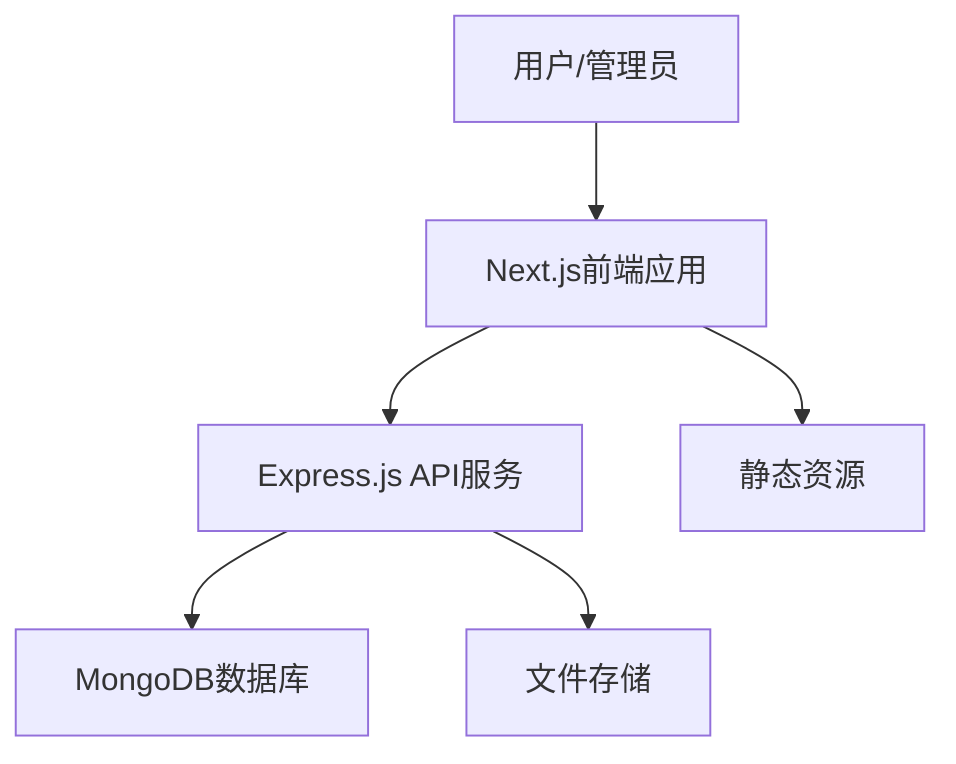
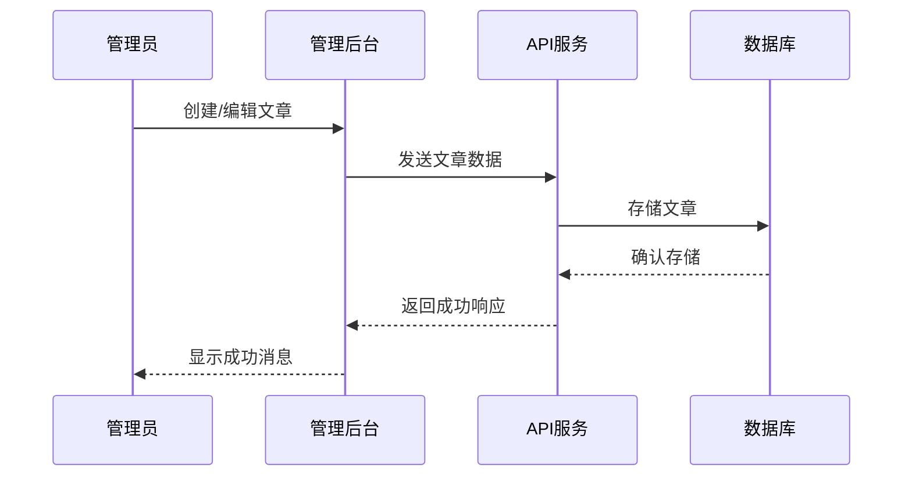
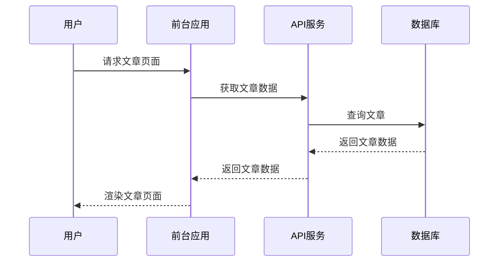
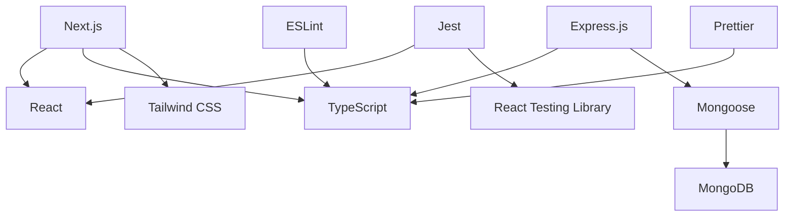
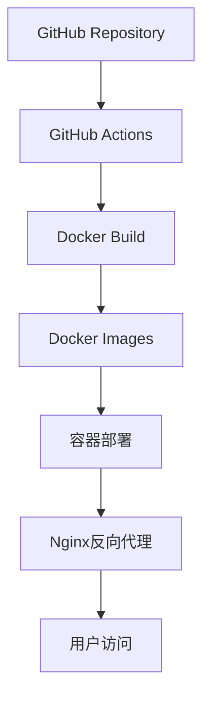

# 系统架构

本文档描述了个人博客系统的整体架构设计，包括系统组件、数据流和技术选型依据。

## 架构概览

个人博客系统采用前后端分离的架构，使用Next.js作为前端框架，Express.js作为后端API服务，MongoDB作为数据存储。

## 核心组件

### 前端应用 (Next.js)
- **职责**：提供用户界面，处理路由，实现服务端渲染
- **主要模块**：
  - 博客前台：文章展示、分类浏览、搜索、评论
  - 管理后台：内容管理、系统设置

### API服务 (Express.js)
- **职责**：提供RESTful API，处理业务逻辑，数据验证
- **主要模块**：
  - 认证服务：用户登录、权限控制
  - 内容服务：文章、分类、评论的CRUD操作
  - 文件服务：图片上传、处理

### 数据存储 (MongoDB)
- **职责**：持久化存储应用数据
- **主要集合**：
  - users：用户信息
  - articles：文章内容
  - categories：分类信息
  - comments：评论数据
  - settings：系统设置

## 数据流

### 文章发布流程

### 文章阅读流程

## 技术选型依据

### Next.js
- **优势**：
  - 服务端渲染(SSR)提高首屏加载速度和SEO表现
  - 内置路由系统简化页面导航
  - 支持静态站点生成(SSG)，提高性能
  - React生态系统的强大支持
- **替代方案**：Gatsby, Nuxt.js
- **选择理由**：Next.js提供了更灵活的渲染策略，同时保持了良好的开发体验

### Express.js
- **优势**：
  - 轻量级和灵活性
  - 丰富的中间件生态
  - 易于学习和使用
  - 与TypeScript良好集成
- **替代方案**：Nest.js, Koa.js
- **选择理由**：Express简单直接，适合中小型项目，学习曲线平缓

### MongoDB
- **优势**：
  - 文档型数据库适合存储博客文章等半结构化数据
  - 灵活的模式设计，易于扩展
  - 良好的查询性能
  - 与Node.js生态系统无缝集成
- **替代方案**：PostgreSQL, MySQL
- **选择理由**：MongoDB的文档模型非常适合博客系统的内容存储需求

## 依赖关系图

## 部署架构

## 安全考虑

- 使用JWT进行身份验证
- HTTPS加密所有通信
- 输入验证和消毒防止XSS和注入攻击
- 适当的访问控制和权限管理
- 敏感数据加密存储

## 性能优化

- 使用Next.js的SSG和ISR功能优化页面加载
- 实现数据缓存减少数据库查询
- 图片优化和懒加载
- 代码分割减少初始加载时间
- CDN分发静态资源