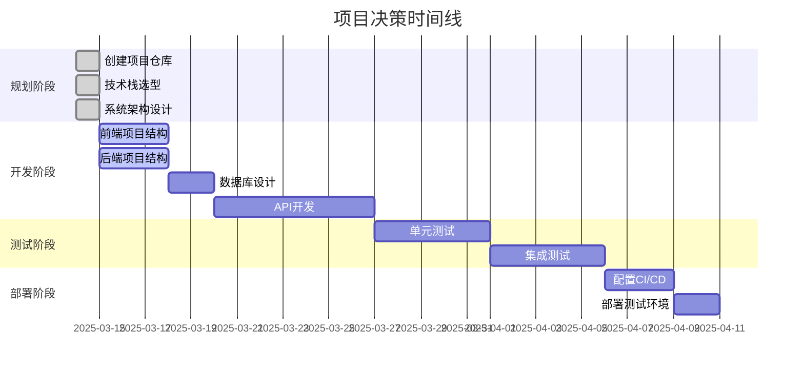

# 项目状态报告

## 项目概述

个人博客系统是一个现代化的博客平台，支持文章发布、管理、分类和评论等功能。项目采用前后端分离架构，使用React、Next.js、Express和MongoDB等技术栈。

## 当前阶段进展

**当前阶段**: 项目初始化与规划

**完成度**: 10%

**开始日期**: 2025-03-14

**预计完成日期**: 待定

## 已完成任务

- [x] 创建项目仓库
- [x] 编写项目README
- [x] 添加许可证文件
- [x] 创建贡献指南
- [x] 编写系统架构文档
- [x] 编写部署指南

## 进行中任务

- [ ] 创建前端项目结构
- [ ] 创建后端项目结构
- [ ] 设计数据库模型
- [ ] 实现基础API

## 待办任务

- [ ] 实现用户认证
- [ ] 开发文章管理功能
- [ ] 开发分类管理功能
- [ ] 开发评论系统
- [ ] 实现前台展示页面
- [ ] 实现管理后台
- [ ] 编写测试用例
- [ ] 配置CI/CD流程
- [ ] 部署测试环境

## 风险和问题

| 风险/问题 | 描述 | 影响 | 缓解措施 | 状态 |
|---------|------|------|---------|------|
| 技术选型 | 技术栈的学习曲线可能影响开发速度 | 中 | 提前学习和准备技术文档 | 进行中 |
| 数据模型设计 | 不合理的数据模型可能导致后期重构 | 高 | 仔细规划数据模型，考虑扩展性 | 待处理 |
| 性能问题 | 大量文章和评论可能导致性能下降 | 中 | 实现分页、缓存和索引优化 | 待处理 |

## 下一步计划

1. 创建前端和后端的基础项目结构
2. 设计并实现数据库模型
3. 开发基础API和认证系统
4. 实现核心功能的前端界面

## 资源使用

### 技术资源

- GitHub仓库: [personal-blog-test](https://github.com/Zanedname/personal-blog-test)
- 开发环境: 本地开发环境
- 测试环境: 待配置
- 生产环境: 待配置

## 决策记录

| 日期 | 决策 | 原因 | 替代方案 | 影响 |
|------|------|------|---------|------|
| 2025-03-14 | 采用Next.js作为前端框架 | 提供SSR和SSG能力，提高SEO和性能 | Gatsby, CRA | 增加学习成本，但提高应用性能 |
| 2025-03-14 | 使用MongoDB作为数据库 | 灵活的文档模型适合博客内容存储 | PostgreSQL, MySQL | 简化数据模型设计，但可能牺牲一些关系型特性 |

## 经验教训

### 成功经验

- 项目初始化阶段充分规划和文档化，为后续开发奠定基础

### 遇到的挑战

- 待记录

### 改进建议

- 待记录

## 决策时间线

